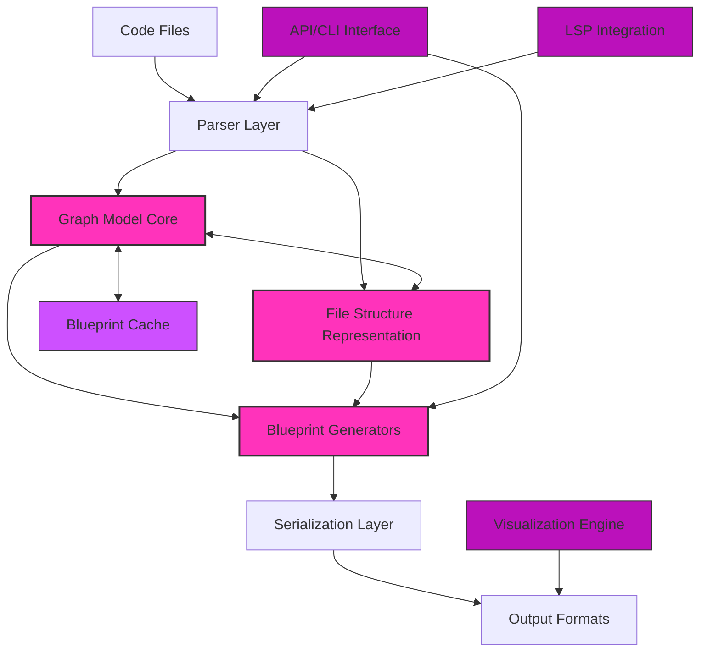
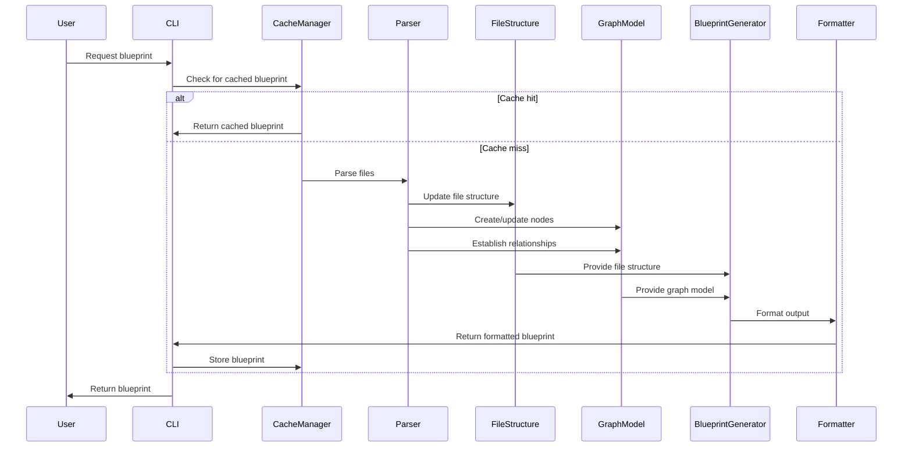
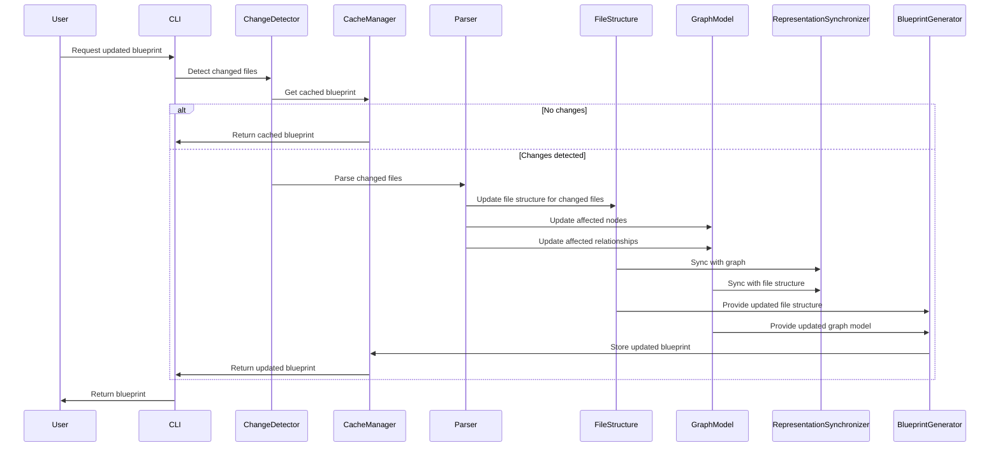

# Architectum Architecture Document

## 1. Architecture Overview

Architectum is a graph-based code comprehension system designed to transform codebases into navigable relationship networks that serve both AI assistants and human developers. This document outlines the technical architecture of Architectum, focusing on its core components, data models, and interactions.

### 1.1 High-Level Architecture

Architectum employs a multi-layered architecture with a graph model at its core and a parallel file structure representation:



The architecture consists of:

1. **Parser Layer**: Extracts code structure and relationships from source files, optionally leveraging LSP
2. **Graph Model Core**: Represents code as a network of nodes and relationships
3. **File Structure Representation**: Maintains a parallel JSON-based representation mirroring the original codebase structure
4. **Blueprint Generators**: Creates different types of blueprints based on the graph model and file structure
5. **Serialization Layer**: Converts blueprints to various output formats
6. **API/CLI Interface**: Provides interaction points for users and other systems
7. **Blueprint Cache**: Stores generated blueprints for incremental updates
8. **LSP Integration**: Optional enhancement for more accurate relationship extraction
9. **Visualization Engine**: Renders graph-based blueprints for human consumption

### 1.2 Core Design Principles

Architectum's architecture is guided by the following principles:

- **Dual Representation**: Code is represented both as a graph (relationship-focused) and as a mimicked file structure (navigation-focused)
- **Graph-Based Representation**: Code is modeled as a network of nodes and relationships rather than a hierarchy
- **File Structure Mirroring**: The system maintains a JSON representation that mirrors the original codebase structure
- **Multi-Level Detail**: All blueprints support configurable levels of detail
- **Incremental Processing**: Changes should only regenerate affected portions of blueprints
- **Format Flexibility**: Internal processing uses JSON but supports transformation to other formats
- **Extension Points**: Clear interfaces for adding new languages, blueprint types, and features

## 2. Core Components

### 2.1 File Structure Representation

Architectum maintains a JSON-based representation that mirrors the original codebase structure, allowing AI agents to navigate through files and directories in a familiar way.

#### 2.1.1 File Structure Model

```python
class FileStructure:
    """Represents the file structure of a codebase."""
    
    root_path: str
    files: Dict[str, FileContent]
    directories: Dict[str, DirectoryContent]
    
    def get_file(self, path: str) -> Optional[FileContent]:
        """Get a file by path."""
        
    def get_directory(self, path: str) -> Optional[DirectoryContent]:
        """Get a directory by path."""
        
    def to_json(self) -> Dict[str, Any]:
        """Convert the file structure to a JSON representation."""

class FileContent:
    """Represents the content of a file."""
    
    path: str
    extension: str
    elements: Dict[str, CodeElement]
    imports: List[str]
    
    def to_json(self) -> Dict[str, Any]:
        """Convert the file content to a JSON representation."""

class DirectoryContent:
    """Represents the content of a directory."""
    
    path: str
    files: List[str]
    subdirectories: List[str]
    
    def to_json(self) -> Dict[str, Any]:
        """Convert the directory content to a JSON representation."""

class CodeElement:
    """Represents a code element (function, class, etc.)."""
    
    name: str
    type: ElementType
    line_start: int
    line_end: int
    metadata: Dict[str, Any]
    
    def to_json(self) -> Dict[str, Any]:
        """Convert the code element to a JSON representation."""
```

#### 2.1.2 JSON File Representation Example

```json
{
  "path": "src/services/user_service.py",
  "extension": ".py",
  "elements": {
    "UserService": {
      "name": "UserService",
      "type": "class",
      "line_start": 10,
      "line_end": 50,
      "methods": ["get_user", "update_user"],
      "properties": ["db_client"]
    },
    "get_user": {
      "name": "get_user",
      "type": "method",
      "line_start": 15,
      "line_end": 25,
      "parent": "UserService",
      "parameters": [{"name": "user_id", "type": "str"}],
      "return_type": "User"
    }
  },
  "imports": ["src/models/user.py", "src/database/client.py"]
}
```

#### 2.1.3 Directory Structure Example

```json
{
  "path": "src/services",
  "files": ["user_service.py", "auth_service.py"],
  "subdirectories": ["utils"]
}
```

### 2.2 Graph Model Core

The Graph Model is the central component of Architectum, representing code as a directed graph of nodes and relationships.

#### 2.2.1 Node Types

```python
class Node:
    """Base class for all nodes in the graph."""
    id: str
    type: NodeType
    metadata: Dict[str, Any]

class FileNode(Node):
    """Represents a file in the codebase."""
    path: str
    extension: str
    
class DirectoryNode(Node):
    """Represents a directory in the codebase."""
    path: str

class FunctionNode(Node):
    """Represents a function/method in the codebase."""
    name: str
    parameters: List[ParameterInfo]
    return_type: Optional[TypeInfo]
    line_start: int
    line_end: int

class ClassNode(Node):
    """Represents a class in the codebase."""
    name: str
    properties: List[PropertyInfo]
    line_start: int
    line_end: int

class FeatureNode(Node):
    """Represents a virtual feature grouping."""
    name: str
    description: str
```

#### 2.2.2 Relationship Types

```python
class Relationship:
    """Base class for all relationships in the graph."""
    source_id: str
    target_id: str
    type: RelationshipType
    metadata: Dict[str, Any]

class ContainsRelationship(Relationship):
    """Represents a containment relationship (directory contains file, file contains function)."""
    
class CallsRelationship(Relationship):
    """Represents a function call relationship."""
    line_number: Optional[int]
    
class ImportsRelationship(Relationship):
    """Represents a file import relationship."""
    
class InheritsRelationship(Relationship):
    """Represents a class inheritance relationship."""
    
class ImplementsRelationship(Relationship):
    """Represents a function implementing a feature."""
```

#### 2.2.3 Graph Operations

The Graph Model provides operations for:

- **Node and Relationship CRUD**: Create, read, update, and delete nodes and relationships
- **Traversal**: Navigate the graph structure in any direction
- **Filtering**: Select nodes and relationships based on criteria
- **Subgraph Extraction**: Create focused views for specific blueprint types
- **Serialization**: Convert to/from JSON representation
- **Caching**: Store and retrieve graph state

### 2.3 Parser Layer

The Parser Layer analyzes source code files to extract structural information and relationship data.

#### 2.3.1 Language-Specific Parsers

```python
class Parser:
    """Base interface for language-specific parsers."""
    
    def parse_file(self, file_path: str, detail_level: DetailLevel) -> Tuple[List[Node], FileContent]:
        """Parse a file and return extracted nodes and file content."""
        
    def detect_relationships(self, nodes: List[Node], detail_level: DetailLevel) -> List[Relationship]:
        """Detect relationships between nodes."""

class PythonParser(Parser):
    """Parser implementation for Python files."""
    
class JavaScriptParser(Parser):
    """Parser implementation for JavaScript/TypeScript files."""
```

#### 2.3.2 LSP Integration (Optional Enhancement)

```python
class LSPClient:
    """Client for communicating with language servers."""
    
    def connect_to_server(self, language: str) -> bool:
        """Connect to appropriate language server."""
        
    def get_document_symbols(self, file_path: str) -> Dict[str, Any]:
        """Get symbols from a document via LSP."""
        
    def get_call_hierarchy(self, position: Position) -> Dict[str, Any]:
        """Get call hierarchy for a position via LSP."""
```

### 2.4 Blueprint Generators

Blueprint Generators create specialized views of the graph model based on user-defined parameters.

#### 2.4.1 Blueprint Types

```python
class Blueprint:
    """Base class for all blueprint types."""
    
    graph: Graph
    file_structure: Optional[FileStructure]
    detail_level: DetailLevel
    
    def to_json(self) -> Dict[str, Any]:
        """Convert blueprint to JSON representation."""
        
    def to_xml(self) -> str:
        """Convert blueprint to XML representation."""

class DirectoryBlueprint(Blueprint):
    """Blueprint focused on a directory structure."""
    
    directory_path: str
    scan_depth: int
    
    def generate(self) -> None:
        """Generate blueprint for the specified directory."""

class FileSetBlueprint(Blueprint):
    """Blueprint focused on a set of files."""
    
    file_paths: List[str]
    
    def generate(self) -> None:
        """Generate blueprint for the specified files."""

class CodeElementBlueprint(Blueprint):
    """Blueprint focused on specific code elements."""
    
    file_path: str
    element_names: List[str]
    
    def generate(self) -> None:
        """Generate blueprint for the specified code elements."""
```

#### 2.4.2 Detail Levels

```python
class DetailLevel(Enum):
    """Enum for blueprint detail levels."""
    
    MINIMAL = 1  # Basic structure and relationships
    STANDARD = 2  # Additional types and signatures
    DETAILED = 3  # Full documentation and annotations
```

### 2.5 Serialization Layer

The Serialization Layer converts graph-based blueprints to various output formats.

#### 2.5.1 Output Formats

```python
class OutputFormatter:
    """Base class for output formatters."""
    
    def format(self, blueprint: Blueprint) -> str:
        """Format blueprint for output."""

class JSONFormatter(OutputFormatter):
    """Format blueprint as JSON."""
    
class XMLFormatter(OutputFormatter):
    """Format blueprint as XML."""
    
class VisualizationFormatter(OutputFormatter):
    """Format blueprint for visualization engines."""
```

### 2.6 API/CLI Interface

The API/CLI Interface provides external access to Architectum's capabilities.

#### 2.6.1 CLI Commands

```python
@click.group()
def cli():
    """Architectum CLI for code blueprint generation."""

@cli.command()
@click.option('--path', required=True, help='Target directory path')
@click.option('--depth', default=0, help='Scan depth (0 for all)')
@click.option('--level', default='minimal', help='Detail level')
@click.option('--output', default='-', help='Output file (- for stdout)')
@click.option('--format', default='json', help='Output format')
def directory_blueprint(path, depth, level, output, format):
    """Generate blueprint for a directory."""
    
@cli.command()
@click.option('--files', required=True, help='Comma-separated file paths')
@click.option('--level', default='minimal', help='Detail level')
@click.option('--output', default='-', help='Output file (- for stdout)')
@click.option('--format', default='json', help='Output format')
def fileset_blueprint(files, level, output, format):
    """Generate blueprint for a set of files."""
    
@cli.command()
@click.option('--file', required=True, help='Source file path')
@click.option('--elements', required=True, help='Comma-separated element names')
@click.option('--level', default='minimal', help='Detail level')
@click.option('--output', default='-', help='Output file (- for stdout)')
@click.option('--format', default='json', help='Output format')
def codeelement_blueprint(file, elements, level, output, format):
    """Generate blueprint for specific code elements."""
```

#### 2.6.2 API Endpoints (Optional)

```python
@app.route('/blueprints/directory', methods=['POST'])
def directory_blueprint_api():
    """API endpoint for directory blueprint generation."""
    data = request.json
    path = data.get('targetDirectoryPath')
    depth = data.get('scanDepth', 0)
    level = data.get('detailLevel', 'minimal')
    
    # Generate blueprint and return as JSON
    
@app.route('/blueprints/fileset', methods=['POST'])
def fileset_blueprint_api():
    """API endpoint for file set blueprint generation."""
    data = request.json
    files = data.get('listOfFilePaths', [])
    level = data.get('detailLevel', 'minimal')
    
    # Generate blueprint and return as JSON
    
@app.route('/blueprints/codeelement', methods=['POST'])
def codeelement_blueprint_api():
    """API endpoint for code element blueprint generation."""
    data = request.json
    file = data.get('filePath')
    elements = data.get('elementNames', [])
    level = data.get('detailLevel', 'minimal')
    
    # Generate blueprint and return as JSON
```

## 3. File Navigation and Dual Representation

Architectum provides dual navigation capabilities through both the file structure and the graph model.

### 3.1 File Structure Navigation

```python
class FileNavigator:
    """Provides navigation through the file structure."""
    
    file_structure: FileStructure
    
    def list_directories(self, path: str = None) -> List[str]:
        """List directories at the given path."""
        
    def list_files(self, path: str = None) -> List[str]:
        """List files at the given path."""
        
    def get_file_content(self, path: str) -> Optional[FileContent]:
        """Get the content of a file."""
        
    def find_element(self, name: str, path: str = None) -> List[Tuple[str, CodeElement]]:
        """Find elements by name across files."""
```

### 3.2 Graph Navigation

```python
class GraphNavigator:
    """Provides navigation through the graph model."""
    
    graph: Graph
    
    def get_node(self, node_id: str) -> Optional[Node]:
        """Get a node by ID."""
        
    def get_relationships(self, node_id: str, relationship_type: Optional[RelationshipType] = None) -> List[Relationship]:
        """Get relationships for a node."""
        
    def find_nodes(self, criteria: Dict[str, Any]) -> List[Node]:
        """Find nodes matching criteria."""
        
    def traverse(self, start_node_id: str, relationship_type: RelationshipType, direction: Direction) -> List[Node]:
        """Traverse the graph from a starting node."""
```

### 3.3 Dual Representation Synchronization

```python
class RepresentationSynchronizer:
    """Ensures consistency between file structure and graph representations."""
    
    def file_to_node(self, file_path: str) -> Optional[str]:
        """Convert a file path to a node ID."""
        
    def node_to_file(self, node_id: str) -> Optional[str]:
        """Convert a node ID to a file path."""
        
    def element_to_node(self, file_path: str, element_name: str) -> Optional[str]:
        """Convert a file element to a node ID."""
        
    def node_to_element(self, node_id: str) -> Optional[Tuple[str, str]]:
        """Convert a node ID to a file path and element name."""
```

## 4. Blueprint Caching & Incremental Updates

### 4.1 Blueprint Caching

Architectum implements a caching system to store generated blueprints and avoid redundant processing.

```python
class BlueprintCache:
    """Cache for storing generated blueprints."""
    
    def store(self, key: str, blueprint: Blueprint) -> None:
        """Store a blueprint in the cache."""
        
    def retrieve(self, key: str) -> Optional[Blueprint]:
        """Retrieve a blueprint from the cache."""
        
    def invalidate(self, key: str) -> None:
        """Invalidate a cached blueprint."""
        
    def is_valid(self, key: str, file_hashes: Dict[str, str]) -> bool:
        """Check if a cached blueprint is still valid."""
```

### 4.2 Incremental Updates

When files change, Architectum updates only affected portions of both representations.

```python
class ChangeDetector:
    """Detects changes in the codebase."""
    
    def get_file_hash(self, file_path: str) -> str:
        """Generate a hash for a file."""
        
    def get_changed_files(self, file_paths: List[str], previous_hashes: Dict[str, str]) -> List[str]:
        """Identify which files have changed."""
        
class RepresentationUpdater:
    """Updates both representations based on changes."""
    
    def update_file_structure(self, file_structure: FileStructure, changed_files: List[str]) -> None:
        """Update file structure for changed files."""
        
    def update_graph(self, graph: Graph, changed_files: List[str], detail_level: DetailLevel) -> None:
        """Update graph for changed files."""
        
    def synchronize_representations(self, file_structure: FileStructure, graph: Graph) -> None:
        """Ensure both representations are in sync."""
```

## 5. Pipeline Architecture

### 5.1 Blueprint Generation Pipeline

The following sequence diagram illustrates the blueprint generation process:



### 5.2 Incremental Update Pipeline

When files change, the incremental update process is triggered:



## 6. Virtual Feature Slicing

A key capability of Architectum is "virtual feature slicing" - creating feature-oriented views of code regardless of physical organization.

### 6.1 Feature Tagging

```python
class FeatureTagger:
    """Tags code elements with feature associations."""
    
    def tag_element(self, element_id: str, feature_name: str) -> None:
        """Associate an element with a feature."""
        
    def get_element_features(self, element_id: str) -> List[str]:
        """Get features associated with an element."""
        
    def get_feature_elements(self, feature_name: str) -> List[str]:
        """Get elements associated with a feature."""
```

### 6.2 Feature Slice Generation

```python
class FeatureSlice(Blueprint):
    """Blueprint focused on a specific feature."""
    
    feature_name: str
    
    def generate(self) -> None:
        """Generate blueprint for the specified feature."""
        # Identify all elements tagged with the feature
        # Extract a subgraph including those elements and their relationships
        # Include relevant context (containing files, related functions)
```

## 7. Technical Implementation

### 7.1 Technology Stack

- **Primary Language**: Python 3.9+
- **Graph Library**: NetworkX or custom implementation
- **CLI Framework**: Click
- **API Framework** (optional): Flask/FastAPI
- **Serialization**: JSON (primary), XML (for AI consumption)
- **Testing**: pytest, hypothesis, pact
- **Documentation**: Sphinx

### 7.2 Module Organization

```
architectum/
├── arch_blueprint_generator/
│   ├── __init__.py
│   ├── models/                   # Core data models
│   │   ├── __init__.py
│   │   ├── graph.py             # Graph model
│   │   ├── file_structure.py    # File structure model
│   │   └── nodes.py             # Node and relationship types
│   ├── parsers/                  # Code parsing
│   │   ├── __init__.py
│   │   ├── python_parser.py     # Python-specific parser
│   │   └── javascript_parser.py # JavaScript/TypeScript parser
│   ├── blueprints/               # Blueprint generators
│   │   ├── __init__.py
│   │   ├── directory.py         # DirectoryBlueprint
│   │   ├── fileset.py           # FileSetBlueprint
│   │   └── codeelement.py       # CodeElementBlueprint
│   ├── navigation/               # Navigation components
│   │   ├── __init__.py
│   │   ├── file_navigator.py    # File structure navigation
│   │   └── graph_navigator.py   # Graph navigation
│   ├── formatters/               # Output formatting
│   │   ├── __init__.py
│   │   ├── json_formatter.py    # JSON output
│   │   └── xml_formatter.py     # XML output
│   ├── cache/                    # Caching system
│   │   ├── __init__.py
│   │   └── blueprint_cache.py   # Blueprint caching
│   ├── cli/                      # Command-line interface
│   │   ├── __init__.py
│   │   └── commands.py          # CLI commands
│   └── api/                      # API interface (optional)
│       ├── __init__.py
│       └── routes.py            # API endpoints
├── tests/                        # Testing
│   ├── unit/                     # Unit tests
│   ├── integration/              # Integration tests
│   ├── contracts/                # Contract tests
│   └── snapshots/                # Snapshot tests
└── docs/                         # Documentation
```

## 8. Extension Points

Architectum is designed for extensibility in key areas:

### 8.1 New Languages

New language support can be added by implementing the Parser interface:

```python
class SwiftParser(Parser):
    """Parser implementation for Swift files."""
    
    def parse_file(self, file_path: str, detail_level: DetailLevel) -> Tuple[List[Node], FileContent]:
        """Parse a Swift file and return extracted nodes and file content."""
        
    def detect_relationships(self, nodes: List[Node], detail_level: DetailLevel) -> List[Relationship]:
        """Detect relationships between Swift nodes."""
```

### 8.2 New Blueprint Types

Additional blueprint types can be created by extending the Blueprint base class:

```python
class SystemWideBlueprint(Blueprint):
    """Blueprint providing a system-wide view."""
    
    exclude_patterns: List[str]
    
    def generate(self) -> None:
        """Generate a system-wide blueprint."""
```

### 8.3 New Output Formats

Support for new output formats can be added by implementing the OutputFormatter interface:

```python
class GraphMLFormatter(OutputFormatter):
    """Format blueprint as GraphML for visualization tools."""
    
    def format(self, blueprint: Blueprint) -> str:
        """Format blueprint as GraphML."""
```

## 9. Performance Considerations

### 9.1 Processing Optimizations

- **Lazy Parsing**: Only parse files when needed
- **Partial Updates**: Only re-process changed files
- **Caching Strategy**: Cache blueprints with file hash validation
- **Detail Level Control**: Only extract information required for the requested detail level

### 9.2 Memory Management

- **Streaming Processing**: Process large files in chunks
- **Subgraph Extraction**: Only load relevant portions of the graph into memory
- **Reference Management**: Use weak references for temporary relationships

### 9.3 Parallelization Opportunities

- **File Parsing**: Parse multiple files in parallel
- **Relationship Detection**: Detect relationships in parallel
- **Blueprint Generation**: Generate independent blueprint sections concurrently

## 10. Security Considerations

### 10.1 Code Access

- Blueprint generation operates on files available to the user
- No additional permissions are required beyond file system access
- Code is analyzed locally, not transmitted to external services

### 10.2 Cache Security

- Cached blueprints contain code structure information
- Cache access should be restricted to the user who generated it
- Sensitive information in documentation is preserved in blueprints

## 11. Future Enhancements

### 11.1 Enhanced LSP Integration

- Deeper integration with Language Server Protocol
- Real-time updates as code is edited
- More accurate relationship detection

### 11.2 Advanced Feature Tagging

- AI-assisted feature boundary detection
- Automatic tagging based on naming conventions
- Feature tag propagation through relationships

### 11.3 Interactive Visualization

- Web-based graph visualization
- Interactive navigation through the codebase
- Custom views and filtering

## Change Log

| Change        | Date       | Version | Description                    | Author         |
| ------------- | ---------- | ------- | ------------------------------ | -------------- |
| Initial draft | 05-17-2025 | 0.1     | Initial architecture document  | System Architect |