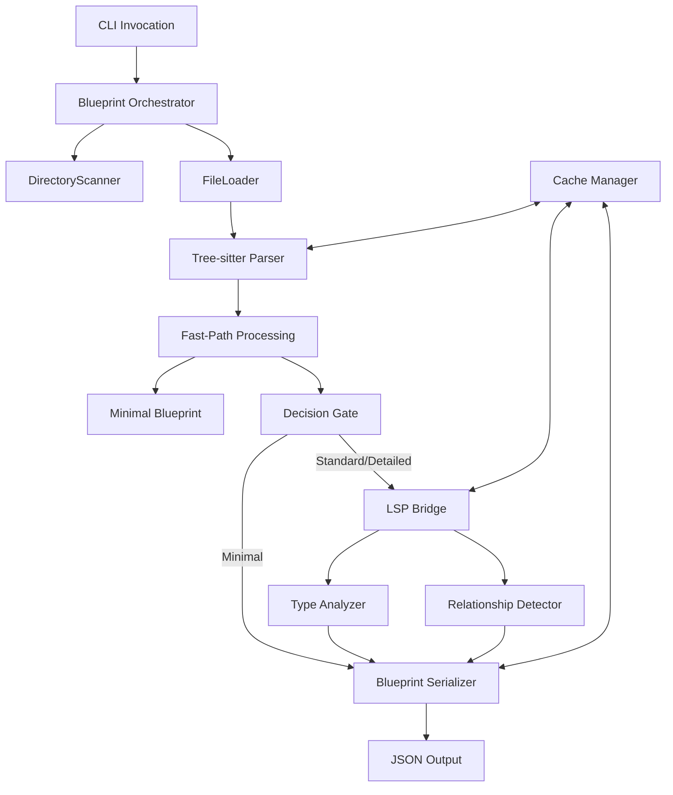

# Architectum Blueprint Generator: Hybrid Architecture

## 1. Technical Summary

The `arch_blueprint_generator` is a high-performance system within the Architectum platform that generates structured JSON blueprints of codebases. It employs a hybrid approach combining fast direct parsing with selective LSP (Language Server Protocol) integration. This design delivers the speed of direct parsing for basic code structure while leveraging LSP's semantic understanding for complex relationships and type information. Supporting three blueprint types (`DirectoryBlueprint`, `FileSetBlueprint`, `CodeElementBlueprint`) and three detail levels (`Minimal`, `Standard`, `Detailed`), it scales efficiently from small files to large codebases.

## 2. Hybrid Processing Architecture



### Key Processing Paths

**Fast Path (Direct Parsing):**

* Uses Tree-sitter for efficient, language-aware parsing
* Extracts basic symbols, imports, exports, and structure
* Sufficient for minimal blueprints
* Completes in milliseconds per file

**Deep Path (LSP Enhancement):**

* Activated only for standard/detailed blueprints or complex code
* Selectively queries LSP for specific symbols and relationships
* Provides accurate type information and cross-file relationships
* Used where semantic understanding is essential

**Integrated Caching:**

* Caches parsing results by file hash
* Caches LSP results by symbol+context hash
* Supports incremental generation for large codebases

## 3. Core Components

### TreeSitterParser

```python
class TreeSitterParser:
    """Fast, incremental parser for extracting code structure."""

    def parse_file(self, file_path):
        language = self._determine_language(file_path)
        parser = self._get_parser(language)
        with open(file_path, 'rb') as f:
            content = f.read()
            tree = parser.parse(content)
        return {
            "symbols": self._extract_symbols(tree, language),
            "imports": self._extract_imports(tree, language),
            "exports": self._extract_exports(tree, language)
        }

    def _extract_symbols(self, tree, language):
        query_str = SYMBOL_QUERIES[language]
        query = Language.query(query_str)
        captures = query.captures(tree.root_node)
        symbols = {}
        for node, capture_name in captures:
            if capture_name == "class.definition":
                class_name = self._extract_name(node)
                symbols[class_name] = {
                    "kind": 5,
                    "range": self._get_range(node),
                    "relationships": {"calls_on": [], "called_by": []}
                }
        return symbols
```

### OptimizedLSPBridge

```python
class OptimizedLSPBridge:
    """Selective LSP integration for deep semantic analysis."""

    def __init__(self):
        self.servers = {}
        self.request_cache = {}

    def enhance_symbol(self, file_path, symbol_name, position, detail_level):
        server = self._get_server_for_file(file_path)
        cache_key = f"{file_path}:{symbol_name}:{position}:{detail_level}"
        if cache_key in self.request_cache:
            return self.request_cache[cache_key]
        if not server.is_running():
            server.start()
        result = {}
        if detail_level in ["standard", "detailed"]:
            hover = server.request("textDocument/hover", {
                "textDocument": {"uri": file_uri},
                "position": position
            })
            result["type_info"] = self._extract_type_info(hover)
            if detail_level == "detailed":
                references = server.request("textDocument/references", {
                    "textDocument": {"uri": file_uri},
                    "position": position,
                    "context": {"includeDeclaration": False}
                })
                result["references"] = self._process_references(references)
        self.request_cache[cache_key] = result
        return result

    def shutdown_all(self):
        for server in self.servers.values():
            if server.is_running():
                server.shutdown()
```

### BlueprintGenerator

```python
class BlueprintGenerator:
    """Generates blueprints at different detail levels."""

    def generate(self, structure, detail_level, context=None):
        if detail_level == "minimal":
            return self._generate_minimal(structure)
        elif detail_level == "standard":
            enhanced = self._enhance_with_lsp(structure, "standard", context)
            return self._generate_standard(enhanced)
        elif detail_level == "detailed":
            enhanced = self._enhance_with_lsp(structure, "detailed", context)
            return self._generate_detailed(enhanced)

    def _enhance_with_lsp(self, structure, detail_level, context):
        lsp_bridge = context.get_lsp_bridge()
        enhanced = copy.deepcopy(structure)
        for symbol_name, symbol_data in enhanced["symbols"].items():
            if self._should_enhance_with_lsp(symbol_data):
                position = self._get_position_from_range(symbol_data["range"])
                lsp_data = lsp_bridge.enhance_symbol(
                    context.file_path, symbol_name, position, detail_level)
                self._merge_lsp_data(symbol_data, lsp_data)
        return enhanced
```

### CacheManager

```python
class CacheManager:
    """Smart caching for both parsed and LSP data."""

    def __init__(self, cache_dir=".architectum/cache"):
        self.cache_dir = cache_dir
        os.makedirs(cache_dir, exist_ok=True)
        self.file_cache = {}
        self.lsp_cache = {}

    def get_parsed_structure(self, file_path):
        file_hash = self._hash_file(file_path)
        cache_key = f"{file_path}:{file_hash}"
        if cache_key in self.file_cache:
            return self.file_cache[cache_key]
        cache_file = os.path.join(self.cache_dir, f"{file_hash}.json")
        if os.path.exists(cache_file):
            with open(cache_file, 'r') as f:
                return json.load(f)
        return None

    def store_parsed_structure(self, file_path, structure):
        file_hash = self._hash_file(file_path)
        cache_key = f"{file_path}:{file_hash}"
        self.file_cache[cache_key] = structure
        cache_file = os.path.join(self.cache_dir, f"{file_hash}.json")
        with open(cache_file, 'w') as f:
            json.dump(structure, f)

    def _hash_file(self, file_path):
        hash_obj = hashlib.sha256()
        with open(file_path, 'rb') as f:
            hash_obj.update(f.read())
        return hash_obj.hexdigest()
```

## 4. Processing Pipeline

**Initialization**

* Load configuration (paths, patterns, detail level)
* Set up caching system
* Initialize parsers for relevant languages

**Fast Path Processing**

* Scan files using tree-sitter for fast structural parsing
* Extract basic symbols, kinds, imports, and exports
* Identify simple relationships based on syntax patterns
* Generate minimal blueprints directly if requested

**Selective LSP Enhancement**

* Initialize LSP servers on-demand for complex symbols
* Query specific symbol information rather than entire files
* Extract detailed type information and relationships
* Cache results for reuse

**Blueprint Assembly**

* Combine parser and LSP data based on detail level
* Format according to blueprint schema
* Apply filters based on configuration

**Output Generation**

* Write JSON blueprints to specified locations
* Generate summary report of processing

## 5. Performance Optimizations

**On-Demand Processing**

* LSP servers only started when needed for complex symbols
* Detailed analysis only applied to requested detail levels
* Framework-specific analysis only applied to relevant files

**Smart Caching Strategy**

* File content hashes detect changes efficiently
* Parsed structure cached per file hash
* LSP results cached per symbol+context
* Cross-run caching for incremental builds
* Selective invalidation on changes

**Parallel Processing**

* Parsing occurs in parallel across multiple files
* LSP queries parallelized when possible
* Worker pool scales based on system resources

**Progressive Enhancement**

* Start with fastest analysis and progressively enhance
* Prioritize critical paths in large codebases
* Background enhancement for less urgent areas

## 6. Blueprint Schemas and Detail Levels

### 6.1 Schema Versioning Strategy

Blueprint outputs will be versioned using a `$schema` field and `version` metadata to ensure forward compatibility:

```json
{
  "$schema": "https://architectum.ai/schema/v1/blueprint.json",
  "version": "1.0.0",
  ...
}
```

* Semantic versioning (MAJOR.MINOR.PATCH) will be used.
* Changes in optional fields or structure extensions will increase MINOR.
* Breaking changes will increase MAJOR.
* Tools consuming the schema must validate compatibility against declared version.

### 6.2 Error/Stub Blueprint Format

When blueprint generation fails (e.g., due to LSP crash, parse error), a stub JSON blueprint is written:

```json
{
  "path": "src/broken_file.ts",
  "error": {
    "type": "LSPFailure",
    "message": "Timed out while requesting hover info.",
    "timestamp": "2025-05-16T12:45:00Z"
  },
  "symbols": {}
}
```

* Always includes `path` and `error` object.
* Allows downstream consumers to distinguish between generated and stub outputs.
* Optionally includes `symbols` if partial data is available.

**Minimal Blueprint**

* Basic file structure
* Symbol kinds (using standard LSP numeric constants)
* High-level relationships
* Imports and exports
* Generated primarily using tree-sitter parsing

**Standard Blueprint**

* Everything in Minimal
* Method signatures with parameters and return types
* Method-level relationships
* Generated using tree-sitter with selective LSP enhancement for type information

**Detailed Blueprint**

* Everything in Standard
* Comprehensive type definitions
* Complete relationship graph
* Framework-specific insights when detected
* Generated using tree-sitter with extensive LSP enhancement

## 7. Implementation Plan

## 7.1 Testing Strategy

**Unit Tests**

* TreeSitterParser: symbol extraction, import/export detection per language
* OptimizedLSPBridge: mock-based testing of enhancement logic and caching
* BlueprintGenerator: blueprint assembly and LSP enhancement merging
* CacheManager: correct behavior on store/load, hash uniqueness

**Integration Tests**

* End-to-end blueprint generation from example directories
* Validate generated JSON matches schema for each detail level
* Stress LSP bridge with large code files
* CLI invocations with various options and YAML configs

**Performance Tests**

* Time-based benchmarks on small/medium/large projects
* Cache hit/miss rate validation
* Parallel processing validation (CPU-bound file batches)

**Error Handling Tests**

* Simulate LSP server failures (timeouts, invalid positions)
* Broken source files: syntax errors, unsupported files
* CLI error messages and exit codes

**CI/CD Coverage**

* Run all tests on PR using GitHub Actions
* Include coverage report and performance thresholds
* Include sample project test cases with snapshot output

**Phase 1: Fast Path (2 weeks)**

* Implement tree-sitter integration for key languages
* Build basic symbol extraction
* Create minimal blueprint generation
* Implement file caching system

**Phase 2: LSP Integration (3 weeks)**

* Develop optimized LSP bridge
* Implement selective LSP querying
* Build symbol enhancement logic
* Create standard blueprint generation

**Phase 3: Full Pipeline (2 weeks)**

* Integrate fast and deep paths
* Implement detailed blueprint generation
* Add relationship analysis
* Optimize performance with parallel processing

**Phase 4: Polish and Extensions (3 weeks)**

* Refine framework detection
* Add visualization capabilities
* Complete CLI interface
* Add monitoring and reporting

## 8. CLI Interface

The CLI interface remains consistent with the original design, supporting both direct commands and YAML configuration:

```bash
arch gen <path> [options]
```

### Options

* `-l, --level <minimal|standard|detailed>`
* `-t, --type <file|dir|codeelement>`
* `-o, --out-dir <path>`
* `--include <glob>`
* `--exclude <glob>`
* `-c, --config <yaml>`
* `--dry-run`
* `--debug`
* `--no-lsp`
* `-h, --help`

### YAML Configuration Example

```yaml
indexes:
  system_index:
    name: system_index
    include: ["src/**/*.ts"]
    exclude: ["**/test/**"]
    detail_level: minimal
    type: dir
    output: ".architectum/system.json"

  auth_focus:
    name: auth_focus
    include: ["src/auth/**/*.ts"]
    type: file
    detail_level: detailed
    output: ".architectum/auth_focus.json"

settings:
  use_lsp: true
  cache_dir: ".architectum/cache"
  parallel_jobs: 4
  lsp_timeout: 5000
```

## 9. Conclusion

The hybrid architecture for Architectum's blueprint generator offers the best of both worlds: the speed and efficiency of direct parsing combined with the semantic understanding of LSP when needed. By employing tree-sitter for fast parsing and selectively using LSP for complex code understanding, this approach scales efficiently from small files to large codebases while maintaining high-quality blueprint output at all detail levels.

This architecture addresses the performance concerns of a pure LSP approach while preserving the accuracy benefits where they matter most. The intelligent caching system and parallel processing capabilities further enhance performance for repeated runs and large codebases.
