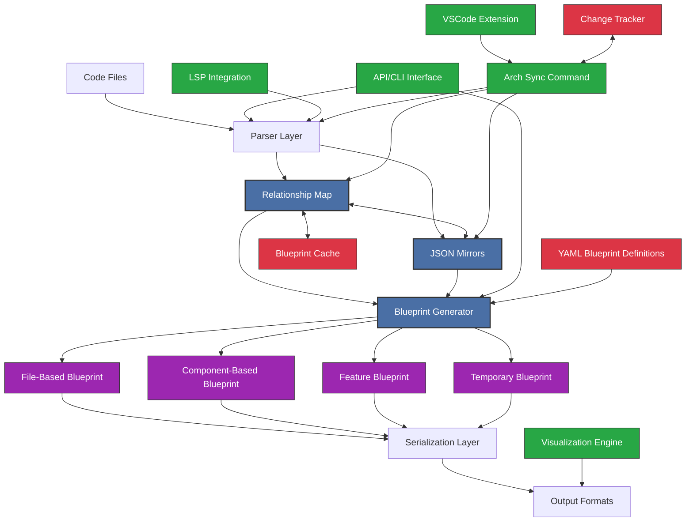
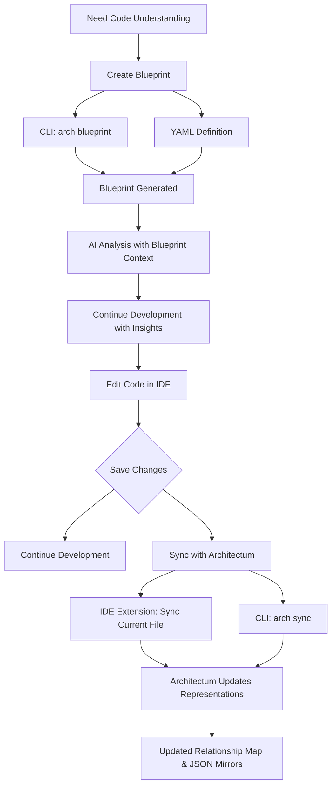
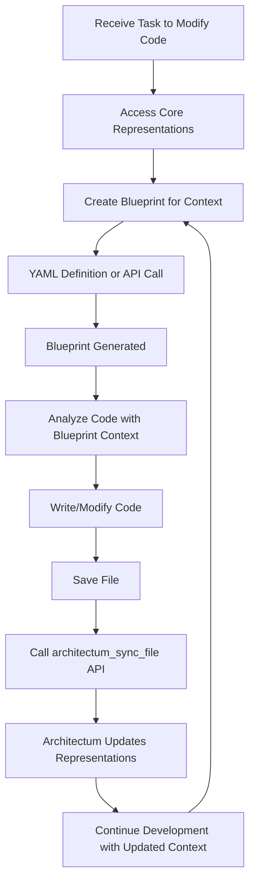
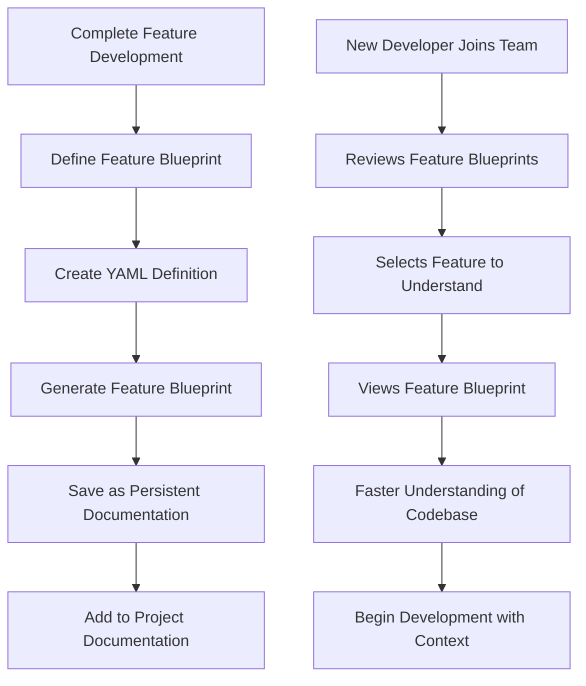

# Architecture Overview

This document provides a high-level overview of Architectum's architecture, focusing on the core design principles, components, and workflows.

## System Purpose

Architectum is a code comprehension system designed to transform codebases into navigable networks that serve both AI assistants and human developers. It addresses two parallel challenges:

1. **AI Comprehension Barriers**: Limited context windows, architectural mismatch, and feature fragmentation make it difficult for AI to understand large codebases.
2. **Human Navigation Challenges**: Developers struggle with mental model limitations, call flow tracing, and feature discovery across architectural boundaries.

## Core Design Principles

Architectum's architecture is guided by the following principles:

- **Dual Core Representation**: Code is represented both as a relationship map (for navigation efficiency) and as JSON mirrors (for detailed content)
- **Blueprint Assembly**: Blueprints are specialized views that combine elements from the core representations based on use cases
- **Declarative Blueprint Definition**: YAML files provide a clear way to define what belongs in a blueprint
- **Developer-Controlled Synchronization**: Developers explicitly control when to synchronize code with Architectum using the `arch sync` command
- **Incremental Processing**: Changes should only regenerate affected portions of representations
- **Format Flexibility**: Internal processing uses JSON for both processing and output formats
- **Extension Points**: Clear interfaces for adding new languages, blueprint types, and features

## Dual Representation Approach

Architectum employs a multi-layered architecture with two core representations:

1. **Relationship Map**: A graph model capturing relationships between code elements, optimized for navigation
2. **JSON Mirrors**: A parallel file structure that mirrors the original codebase with JSON representations of each file, optimized for content access

These core representations are then used to generate various types of **Blueprints** - specialized views assembled for specific purposes.

## High-Level Architecture

## Component Descriptions

1. **Parser Layer**: Extracts code structure and relationships from source files, optionally leveraging LSP
2. **Relationship Map**: Represents code as a network of nodes and relationships
3. **JSON Mirrors**: Maintains a mirrored JSON representation of each file in the codebase
4. **Blueprint Generator**: Creates different types of blueprints based on the core representations
5. **Blueprint Types**:
   - **File-Based Blueprint**: Combines selected files for comprehensive context
   - **Component-Based Blueprint**: Focuses on specific functions/classes within files
   - **Feature Blueprint**: Persistent documentation of a complete feature
   - **Temporary Blueprint**: Ad-hoc creation for immediate development tasks
6. **Serialization Layer**: Converts blueprints to various output formats
7. **API/CLI Interface**: Provides interaction points for users and other systems
8. **Blueprint Cache**: Stores generated blueprints for incremental updates
9. **LSP Integration**: Optional enhancement for more accurate relationship extraction
10. **Visualization Engine**: Renders graph-based blueprints for human consumption
11. **Arch Sync Command**: CLI tool and API for synchronizing code with its Architectum representation
12. **VSCode Extension**: IDE integration for synchronizing files with Architectum
13. **Change Tracker**: Tracks which files need synchronization
14. **YAML Blueprint Definitions**: Configuration files defining blueprint contents

## Blueprint Types

Architectum supports four major blueprint types:

1. **File-Based Blueprint**: 
   - Combines selected files for comprehensive context
   - Useful for understanding a specific set of files as a unit
   - Preserves cross-file relationships

2. **Component-Based Blueprint**:
   - Focuses on specific code elements (functions, classes, methods) within files
   - Highly targeted view of specific components
   - Shows relationships between components with configurable depth

3. **Feature Blueprint**:
   - Persistent documentation of complete features
   - Spans multiple files and components
   - Includes metadata, documentation, and version history

4. **Temporary Blueprint**:
   - Ad-hoc creation for immediate development tasks
   - Same capabilities as Feature Blueprints but not persisted
   - Quick creation for specific analysis needs

## Data Persistence Strategy

### Database Implementation
- **Primary Database**: SQLite for local storage of blueprint metadata and cache references
- **Schema Design**:
  - `blueprints` table: Stores metadata about generated blueprints
  - `blueprint_files` table: Maps blueprints to source files
  - `relationship_cache` table: Stores serialized relationship data
  - `file_mirrors` table: Tracks JSON mirror files

### Caching Implementation
- **Cache Storage**: Native Python implementation using disk-based serialization
- **Cache Structure**:
  - Blueprint cache using Python's `pickle` module for efficient serialization
  - LRU (Least Recently Used) caching strategy for in-memory blueprint components
  - Automatic cache invalidation based on file hash changes
  - Configurable cache size and cleanup policies

## API & Service Implementation Sequence

### Core Service Setup
1. **Base Framework Initialization**: Configure FastAPI application with proper middleware
2. **Utility Layer Implementation**: Create shared utilities before service implementations
3. **Service Layer Implementation**: Establish service architecture before individual endpoints

### API Endpoint Sequence
1. Blueprint definition parsing endpoints
2. Blueprint generation endpoints
3. Synchronization endpoints
4. Utility and management endpoints

## User Workflows

### Human Developer Workflow

### AI Agent Workflow

### Feature Documentation Workflow

## Error Handling Strategy

- **General Approach:** Custom exception hierarchy with a base `ArchitectumError` class
- **Logging:** Structured logging with `structlog` in JSON format
- **Context:** All logs include Correlation ID, Component Name, Operation Name, and relevant parameters
- **Business Exceptions:** All business logic exceptions include `code`, `message`, and `details` fields

## Extension Points

Architectum is designed for extensibility in key areas:

1. **New Languages**: Add new language support by implementing the Parser interface
2. **New Blueprint Types**: Create additional blueprint types by extending the Blueprint base class
3. **New Output Formats**: Support for new output formats by implementing the OutputFormatter interface

## Development Workflow & Deployment

### GitHub Integration
- **Repository Structure**: Monorepo approach with clear separation between core modules
- **Branch Strategy**: `main`, `develop`, `feature/*`, `fix/*`
- **Pull Request Process**: Required code reviews, tests, and static analysis

### Basic CI Workflow
1. **On Pull Request**: Run linting, tests, and generate coverage reports
2. **On Merge to Develop**: Build packages and run performance benchmarks
3. **On Release**: Create tagged release and build distribution packages
