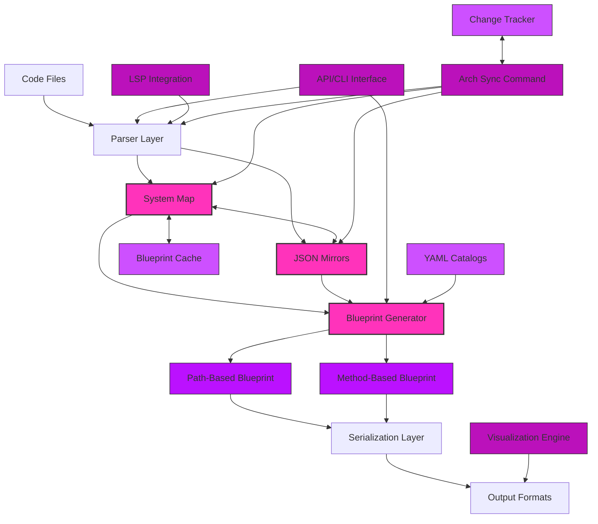
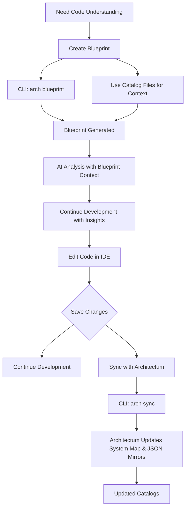
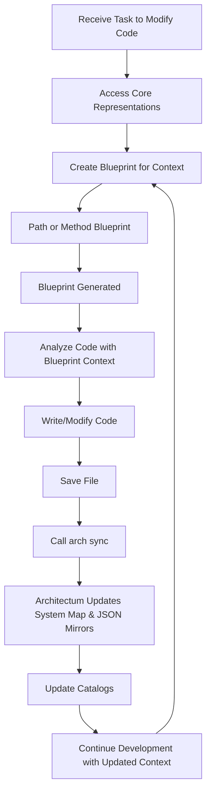
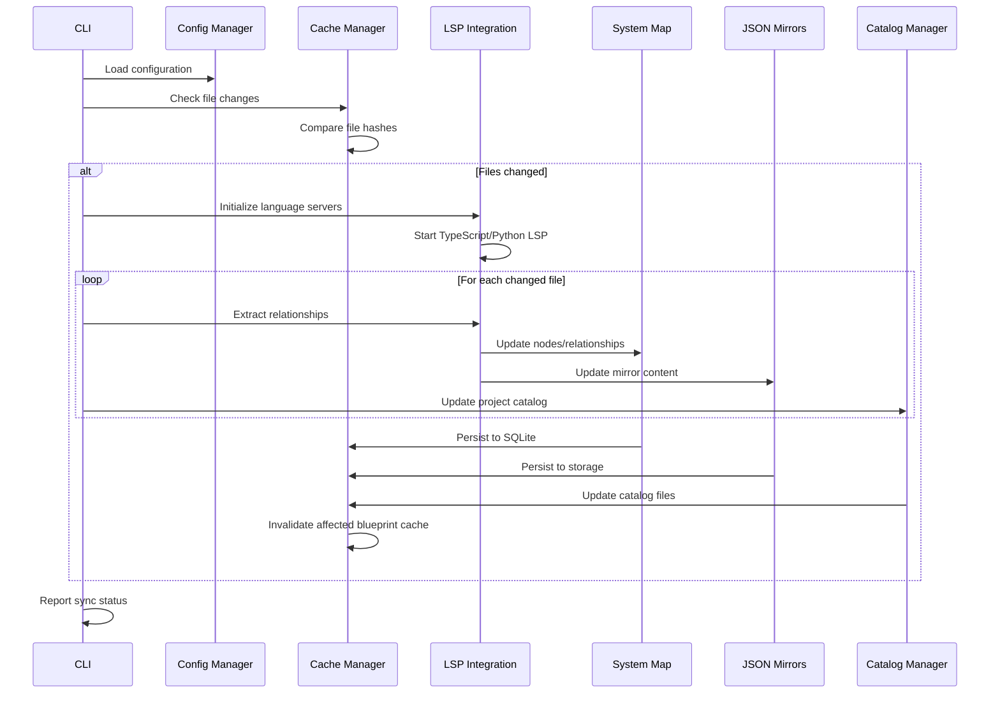
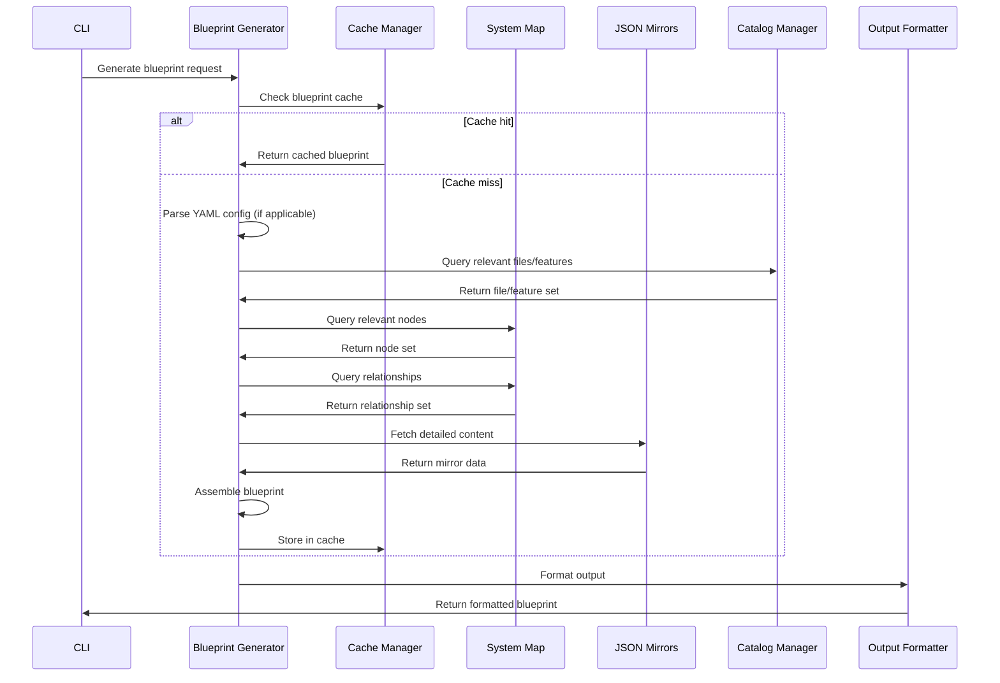

# Architectum Architecture Document

## Introduction / Preamble

This document outlines the overall project architecture for Architectum, a revolutionary code comprehension system that creates relationship-based representations of codebases. The primary goal is to serve as the guiding architectural blueprint for AI-driven development, ensuring consistency and adherence to chosen patterns and technologies.

**System Purpose:** Architectum transforms code comprehension for both AI assistants and human developers by creating a relationship-based representation system that reveals the invisible network of connections defining how software actually functions.

**Relationship to Frontend Architecture:**
This project is primarily a command-line tool and does not include a significant user interface beyond a proof-of-concept web visualizer. The visualizer components are documented within this architecture document.

## Table of Contents

- [Introduction / Preamble](#introduction--preamble)
- [Technical Summary](#technical-summary)
- [High-Level Overview](#high-level-overview)
- [Architectural / Design Patterns Adopted](#architectural--design-patterns-adopted)
- [Component View](#component-view)
- [Project Structure](#project-structure)
- [API Reference](#api-reference)
- [Data Models](#data-models)
- [Core Workflow / Sequence Diagrams](#core-workflow--sequence-diagrams)
- [Definitive Tech Stack Selections](#definitive-tech-stack-selections)
- [Infrastructure and Deployment Overview](#infrastructure-and-deployment-overview)
- [Error Handling Strategy](#error-handling-strategy)
- [Coding Standards](#coding-standards)
- [Overall Testing Strategy](#overall-testing-strategy)
- [Security Best Practices](#security-best-practices)
- [Key Reference Documents](#key-reference-documents)
- [Change Log](#change-log)

## Technical Summary

Architectum employs a three-component architecture consisting of a System Map (graph-based relationship model), JSON Mirrors (detailed content representation), and Blueprints (specialized AI-optimized views). The system leverages Language Server Protocol integration for accurate relationship extraction, implements intelligent caching with incremental updates, and provides both command-line interface and proof-of-concept visualization capabilities. Built with Python 3.13 as a monolithic application with modular component architecture, the system prioritizes automation and scripting over manual intervention while maintaining token efficiency for AI consumption.

## High-Level Overview

**Architectural Style:** Monolithic Python application with modular component architecture deployed as a cross-platform CLI tool.

**Repository Structure:** Monorepo containing the complete Architectum system including parsers, blueprint generators, CLI interface, caching system, and proof-of-concept visualizer.

**Primary Data Flow:** 
1. Code Analysis → LSP Integration → Relationship Extraction
2. System Map Construction + JSON Mirror Generation
3. Blueprint Assembly → Format Optimization → Output Generation



## Architectural / Design Patterns Adopted

- **Graph-Based Representation Pattern** - *Rationale:* Enables efficient traversal of code relationships across architectural boundaries, supporting both programmatic queries and visual navigation.
- **Mirror Architecture Pattern** - *Rationale:* Maintains parallel detailed representations alongside simplified relationship models, enabling both fast navigation and comprehensive analysis.
- **Command Query Separation** - *Rationale:* Clear separation between read operations (blueprint generation, visualization) and write operations (sync, cache updates) for better maintainability.
- **Factory Pattern for Parsers** - *Rationale:* Extensible language support through pluggable parser implementations without core system modifications.
- **Observer Pattern for Change Detection** - *Rationale:* Efficient incremental updates through file system monitoring and hash-based change detection.
- **Template Method Pattern for Blueprints** - *Rationale:* Consistent blueprint generation workflow with customizable assembly strategies for different blueprint types.

## Component View

**System Map Engine**
- Responsibility: Maintains graph-based relationship model with nodes (Files, Functions, Classes, Methods, Features) and relationships (Contains, Calls, Implements, Imports, Inherits, Depends-On)
- Technology: NetworkX for graph operations, SQLite for persistence

**JSON Mirrors Manager**
- Responsibility: Maintains detailed content representation mirroring code files with full signatures, type information, and context preservation
- Technology: Python JSON libraries, file-based storage with compression

**Parser Layer**
- Responsibility: Extracts code structure and relationships from source files, optionally leveraging LSP
- Technology: Language-specific AST parsers, LSP integration

**Blueprint Generator**
- Responsibility: Assembles specialized views from System Map and JSON Mirrors, supporting Path-Based, Method-Based, and YAML-defined blueprints
- Technology: Python templating, format conversion libraries

**Caching System & Change Tracker**
- Responsibility: Implements intelligent caching with file hash-based change detection and incremental update mechanisms
- Technology: SQLite for metadata, SHA-256 hashing, file system monitoring

**CLI Interface & API**
- Responsibility: Provides command-line interface and API for all system operations including sync, blueprint generation, and configuration
- Technology: Click framework for CLI, FastAPI for API endpoints

**Serialization Layer**
- Responsibility: Converts blueprints to various output formats (JSON, XML, human-readable)
- Technology: Built-in JSON, XML libraries, custom formatters

**Visualization Engine**
- Responsibility: Basic web-based graph rendering with interactive navigation and filtering capabilities
- Technology: FastAPI for web server, D3.js for graph visualization

## Project Structure

```plaintext
architectum/
├── .github/                    # CI/CD workflows
│   └── workflows/
│       └── ci.yml
├── .vscode/                    # VSCode settings
│   └── settings.json
├── project_docs/               # Project documentation
│   ├── index.md                # Central navigation document
│   ├── core_documents/         # Core project documentation
│   │   ├── architecture.md     # This document
│   │   ├── prd.md              # Product Requirements Document
│   │   └── project-brief.md    # Project overview and goals
│   ├── epics/                  # Epic-level documentation
│   │   └── epic_1/             # Documentation for Epic 1
│   ├── catalogs/               # YAML catalog files
│   │   ├── feature_catalog.yaml # Feature organization
│   │   ├── project_catalog.yaml # Raw file inventory
│   │   └── test_catalog.yaml   # Test code mapping
│   └── supporting_documents/   # Additional documentation
│       ├── api-reference.md    # CLI command specifications
│       ├── data-models.md      # Data model specifications
│       └── operational-guidelines.md # Development standards
├── src/                        # Application source code
│   ├── architectum/            # Main package
│   │   ├── __init__.py
│   │   ├── core/               # Core business logic and data models
│   │   │   ├── __init__.py
│   │   │   ├── system_map.py   # System Map implementation
│   │   │   ├── json_mirrors.py # JSON Mirrors implementation
│   │   │   ├── nodes.py        # Node and relationship types
│   │   │   ├── relationships.py # Relationship models
│   │   │   └── config.py       # Configuration management
│   │   ├── parsers/            # Language-specific parsers
│   │   │   ├── __init__.py
│   │   │   ├── base.py         # Abstract parser interface
│   │   │   ├── python_parser.py # Python-specific parser
│   │   │   ├── typescript_parser.py # TypeScript/JavaScript parser
│   │   │   └── lsp_integration.py # LSP client integration
│   │   ├── blueprints/         # Blueprint generation
│   │   │   ├── __init__.py
│   │   │   ├── base.py         # Blueprint base class
│   │   │   ├── generator.py    # Main blueprint generator
│   │   │   ├── path_based.py   # Path-based blueprints
│   │   │   ├── method_based.py # Method-based blueprints
│   │   │   ├── yaml_based.py   # YAML-defined blueprints
│   │   │   └── formatters/     # Output formatters
│   │   │       ├── __init__.py
│   │   │       ├── json_formatter.py # JSON output
│   │   │       ├── xml_formatter.py # XML output for AI consumption
│   │   │       └── human_formatter.py # Human-readable output
│   │   ├── caching/            # Caching system
│   │   │   ├── __init__.py
│   │   │   ├── cache_manager.py # Main cache management
│   │   │   ├── hash_utils.py   # File hashing utilities
│   │   │   └── storage.py      # Cache storage implementation
│   │   ├── sync/               # Synchronization components
│   │   │   ├── __init__.py
│   │   │   ├── arch_sync.py    # Main sync implementation
│   │   │   └── change_tracker.py # Change detection and tracking
│   │   ├── yaml/               # YAML catalog management
│   │   │   ├── __init__.py
│   │   │   ├── project_catalog.py # Project catalog operations
│   │   │   ├── feature_catalog.py # Feature catalog operations
│   │   │   └── test_catalog.py # Test catalog operations
│   │   ├── navigation/         # Navigation components
│   │   │   ├── __init__.py
│   │   │   ├── file_navigator.py # JSON mirror navigation
│   │   │   └── graph_navigator.py # System map navigation
│   │   ├── cli/                # Command-line interface
│   │   │   ├── __init__.py
│   │   │   ├── main.py         # Main CLI entry point
│   │   │   ├── commands/       # CLI command implementations
│   │   │   │   ├── __init__.py
│   │   │   │   ├── sync.py     # arch sync command
│   │   │   │   ├── blueprint.py # blueprint commands
│   │   │   │   ├── visualize.py # visualization command
│   │   │   │   └── config.py   # configuration commands
│   │   │   └── utils.py        # CLI utilities
│   │   ├── api/                # API interface
│   │   │   ├── __init__.py
│   │   │   ├── routes.py       # API endpoints
│   │   │   └── models.py       # API data models
│   │   ├── visualizer/         # Proof-of-concept visualizer
│   │   │   ├── __init__.py
│   │   │   ├── server.py       # FastAPI server
│   │   │   ├── static/         # Static web assets
│   │   │   │   ├── css/
│   │   │   │   ├── js/
│   │   │   │   └── index.html
│   │   │   └── templates/      # HTML templates
│   │   └── utils/              # Shared utilities
│   │       ├── __init__.py
│   │       ├── file_utils.py   # File system utilities
│   │       ├── git_utils.py    # Git integration utilities
│   │       └── logger.py       # Logging configuration
├── tests/                      # Automated tests
│   ├── unit/                   # Unit tests (mirroring src structure)
│   ├── integration/            # Integration tests
│   ├── e2e/                    # End-to-end tests
│   ├── contracts/              # Contract tests (Pact)
│   └── fixtures/               # Test data and fixtures
├── scripts/                    # Utility scripts
│   ├── setup_dev.py           # Development environment setup
│   └── benchmark.py           # Performance benchmarking
├── .env.example               # Example environment variables
├── .gitignore                 # Git ignore rules
├── pyproject.toml             # Python project configuration
├── uv.lock                    # UV lock file for dependencies
├── README.md                  # Project overview and setup
└── main.py                    # Application entry point
```

### Key Directory Descriptions

- **project_docs/**: Contains all project planning and reference documentation
- **src/architectum/**: Main application package with modular components
- **src/architectum/core/**: Core business logic including System Map and JSON Mirrors
- **src/architectum/parsers/**: Language-specific parsing implementations and LSP integration
- **src/architectum/blueprints/**: Blueprint generation engine with multiple output formatters
- **src/architectum/caching/**: Intelligent caching system with change detection
- **src/architectum/sync/**: Synchronization components and change tracking
- **src/architectum/yaml/**: YAML catalog management (project_catalog.yaml, feature_catalog.yaml, test_catalog.yaml)
- **tests/**: Comprehensive test suite with unit, integration, contract, and end-to-end tests

### Notes

All configuration is handled through YAML files and environment variables. No hardcoded paths or configuration values are permitted in source code. Build output and cache files are git-ignored and stored in user-specific cache directories.

## API Reference

### External APIs Consumed

#### Language Server Protocol (LSP) Endpoints

- **Purpose:** Extract precise relationship data and type information from source code
- **Base URL(s):**
  - TypeScript: Local LSP server via stdio
  - Python: Local LSP server via stdio
- **Authentication:** None required (local communication)
- **Key Endpoints Used:**
  - **`textDocument/documentSymbol`:**
    - Description: Get symbols from a document
    - Request Parameters: `textDocument.uri` (file URI), `textDocument.version` (document version)
    - Request Body Schema: LSP DocumentSymbolParams
    - Example Request: `{"textDocument": {"uri": "file:///path/to/file.py"}}`
    - Success Response Schema (Code: `200 OK`): Array of DocumentSymbol objects
    - Error Response Schema (Codes: `4xx`, `5xx`): LSP Error objects with code and message
    - Example Response: `[{"name": "MyClass", "kind": 5, "range": {...}, "children": [...]}]`
  - **`textDocument/definition`:**
    - Description: Get definition location for a symbol
    - Request Parameters: `textDocument.uri`, `position` (line/character)
    - Request Body Schema: LSP DefinitionParams
    - Success Response Schema: Location or LocationLink array
    - Error Response Schema: LSP Error objects
  - **`callHierarchy/incomingCalls`:**
    - Description: Get incoming call hierarchy for a symbol
    - Request Parameters: CallHierarchyItem
    - Success Response Schema: Array of CallHierarchyIncomingCall
    - Error Response Schema: LSP Error objects
- **Rate Limits:** None (local communication)
- **Link to Official Docs:** https://microsoft.github.io/language-server-protocol/

### Internal APIs Provided

#### Architectum Core API

- **Purpose:** Programmatic access to Architectum functionality for IDE extensions and external tools
- **Base URL(s):** `http://localhost:8000/api/v1` (when visualizer server is running)
- **Authentication/Authorization:** None required for local development
- **Endpoints:**
  - **`POST /sync`:**
    - Description: Trigger synchronization of codebase with Architectum representations
    - Request Parameters: None
    - Request Body Schema: `{"force": boolean, "paths": string[]}`
    - Success Response Schema (Code: `200 OK`): `{"status": "success", "files_processed": number, "errors": string[]}`
    - Error Response Schema (Codes: `4xx`, `5xx`): `{"error": string, "details": object}`
  - **`POST /blueprint/path`:**
    - Description: Generate path-based blueprint
    - Request Body Schema: `{"path": string, "depth": number, "format": string}`
    - Success Response Schema: `{"blueprint": object, "generated_at": string}`
    - Error Response Schema: `{"error": string, "details": object}`
  - **`POST /blueprint/method`:**
    - Description: Generate method-based blueprint
    - Request Body Schema: `{"components": {"file_path": string[]}, "format": string}`
    - Success Response Schema: `{"blueprint": object, "generated_at": string}`
    - Error Response Schema: `{"error": string, "details": object}`
  - **`GET /system-map/nodes`:**
    - Description: Query System Map nodes
    - Request Parameters: `type` (node type filter), `path` (path filter)
    - Success Response Schema: `{"nodes": Node[], "total": number}`
    - Error Response Schema: `{"error": string}`
  - **`GET /system-map/relationships`:**
    - Description: Query System Map relationships
    - Request Parameters: `source_id`, `target_id`, `type`
    - Success Response Schema: `{"relationships": Relationship[], "total": number}`
    - Error Response Schema: `{"error": string}`

## Data Models

### Core Application Entities

#### Node Types

```python
from dataclasses import dataclass
from typing import Dict, Any, Optional, List
from enum import Enum

class NodeType(Enum):
    FILE = "file"
    DIRECTORY = "directory"
    FUNCTION = "function"
    CLASS = "class"
    METHOD = "method"
    FEATURE = "feature"

@dataclass
class Node:
    """Base class for all nodes in the graph."""
    id: str  # Unique identifier (SHA-256 hash of path + name + type)
    type: NodeType  # Node type
    metadata: Dict[str, Any]  # Additional metadata

@dataclass
class FileNode(Node):
    """Represents a file in the codebase."""
    path: str  # Relative path to file from project root
    extension: str  # File extension including dot
    language: str  # Programming language detected

@dataclass
class DirectoryNode(Node):
    """Represents a directory in the codebase."""
    path: str  # Relative path to directory from project root

@dataclass
class FunctionNode(Node):
    """Represents a function/method in the codebase."""
    name: str  # Function name
    parameters: List[Dict[str, str]]  # Parameter information
    return_type: Optional[str]  # Return type if available
    line_start: int  # Starting line number (1-indexed)
    line_end: int  # Ending line number (1-indexed)
    file_path: str  # Path to containing file

@dataclass
class ClassNode(Node):
    """Represents a class in the codebase."""
    name: str  # Class name
    properties: List[str]  # Class properties
    line_start: int  # Starting line number (1-indexed)
    line_end: int  # Ending line number (1-indexed)
    file_path: str  # Path to containing file

@dataclass
class FeatureNode(Node):
    """Represents a virtual feature grouping."""
    name: str  # Feature name
    description: str  # Feature description
    components: List[str]  # Component IDs in this feature
```

#### Relationship Types

```python
class RelationshipType(Enum):
    CONTAINS = "contains"
    CALLS = "calls"
    IMPLEMENTS = "implements"
    IMPORTS = "imports"
    INHERITS = "inherits"
    DEPENDS_ON = "depends_on"

@dataclass
class Relationship:
    """Base class for all relationships in the graph."""
    id: str  # Unique identifier
    source_id: str  # Source node identifier
    target_id: str  # Target node identifier
    type: RelationshipType  # Relationship type
    metadata: Dict[str, Any]  # Additional metadata

@dataclass
class ContainsRelationship(Relationship):
    """Represents a containment relationship (directory contains file, file contains function)."""
    pass

@dataclass
class CallsRelationship(Relationship):
    """Represents a function call relationship."""
    line_number: Optional[int]  # Line where call occurs
    call_type: str  # direct, indirect, conditional

@dataclass
class ImportsRelationship(Relationship):
    """Represents a file import relationship."""
    import_statement: str  # The actual import statement
    import_type: str  # module, function, class, wildcard

@dataclass
class InheritsRelationship(Relationship):
    """Represents a class inheritance relationship."""
    inheritance_type: str  # extends, implements, mixin

@dataclass
class ImplementsRelationship(Relationship):
    """Represents a function implementing a feature."""
    feature_aspect: str  # Which aspect of the feature
```

### API Payload Schemas

#### Blueprint Request

```python
@dataclass
class PathBlueprintRequest:
    """Request schema for path-based blueprint generation."""
    path: str  # Directory path to analyze
    depth: int = 0  # Depth to scan (0 for all levels)
    format: str = "json"  # Output format: json, xml, human
    include_tests: bool = False  # Include test files

@dataclass
class MethodBlueprintRequest:
    """Request schema for method-based blueprint generation."""
    components: Dict[str, List[str]]  # file_path -> method_names mapping
    format: str = "json"  # Output format
    include_callers: bool = False  # Include calling functions
    include_callees: bool = False  # Include called functions
```

### Database Schemas

#### system_map_nodes Table

- **Purpose:** Stores all nodes in the System Map with full metadata
- **Schema Definition:**
  ```sql
  CREATE TABLE system_map_nodes (
      id VARCHAR(64) PRIMARY KEY,  -- SHA-256 hash
      type VARCHAR(20) NOT NULL,   -- NodeType enum value
      name VARCHAR(255),           -- Node name (nullable for directories)
      path VARCHAR(1000),          -- File/directory path
      language VARCHAR(50),        -- Programming language
      line_start INTEGER,          -- Starting line (nullable)
      line_end INTEGER,            -- Ending line (nullable)
      metadata JSON,               -- Additional metadata as JSON
      file_hash VARCHAR(64),       -- SHA-256 of source file
      created_at TIMESTAMP DEFAULT CURRENT_TIMESTAMP,
      updated_at TIMESTAMP DEFAULT CURRENT_TIMESTAMP,
      
      INDEX idx_type (type),
      INDEX idx_path (path),
      INDEX idx_language (language),
      INDEX idx_file_hash (file_hash)
  );
  ```

#### system_map_relationships Table

- **Purpose:** Stores relationships between nodes with metadata
- **Schema Definition:**
  ```sql
  CREATE TABLE system_map_relationships (
      id VARCHAR(64) PRIMARY KEY,  -- SHA-256 hash
      source_node_id VARCHAR(64) NOT NULL,
      target_node_id VARCHAR(64) NOT NULL,
      type VARCHAR(20) NOT NULL,   -- RelationshipType enum value
      line_number INTEGER,         -- Line where relationship occurs
      metadata JSON,               -- Additional metadata as JSON
      created_at TIMESTAMP DEFAULT CURRENT_TIMESTAMP,
      
      FOREIGN KEY (source_node_id) REFERENCES system_map_nodes(id) ON DELETE CASCADE,
      FOREIGN KEY (target_node_id) REFERENCES system_map_nodes(id) ON DELETE CASCADE,
      INDEX idx_source (source_node_id),
      INDEX idx_target (target_node_id),
      INDEX idx_type (type),
      UNIQUE INDEX idx_unique_relationship (source_node_id, target_node_id, type, line_number)
  );
  ```

#### json_mirrors Table

- **Purpose:** Stores JSON Mirror data with metadata and change tracking
- **Schema Definition:**
  ```sql
  CREATE TABLE json_mirrors (
      file_path VARCHAR(1000) PRIMARY KEY,
      language VARCHAR(50) NOT NULL,
      content JSON NOT NULL,          -- Full JSON mirror content
      file_hash VARCHAR(64) NOT NULL, -- SHA-256 of source file
      mirror_hash VARCHAR(64) NOT NULL, -- SHA-256 of mirror content
      last_updated TIMESTAMP DEFAULT CURRENT_TIMESTAMP,
      
      INDEX idx_language (language),
      INDEX idx_file_hash (file_hash),
      INDEX idx_last_updated (last_updated)
  );
  ```

#### blueprint_cache Table

- **Purpose:** Caches generated blueprints to avoid regeneration
- **Schema Definition:**
  ```sql
  CREATE TABLE blueprint_cache (
      cache_key VARCHAR(64) PRIMARY KEY, -- SHA-256 of request parameters
      blueprint_type VARCHAR(50) NOT NULL,
      content JSON NOT NULL,              -- Cached blueprint content
      dependencies JSON,                  -- List of file paths/hashes this depends on
      created_at TIMESTAMP DEFAULT CURRENT_TIMESTAMP,
      accessed_at TIMESTAMP DEFAULT CURRENT_TIMESTAMP,
      
      INDEX idx_type (blueprint_type),
      INDEX idx_created (created_at),
      INDEX idx_accessed (accessed_at)
  );
  ```

## Core Workflow / Sequence Diagrams

### Human Developer Workflow



### AI Agent Workflow



### System Sync Workflow



### Blueprint Generation Workflow



## Definitive Tech Stack Selections

| Category             | Technology              | Version / Details | Description / Purpose                   | Justification |
| :------------------- | :---------------------- | :---------------- | :-------------------------------------- | :------------ |
| **Languages**        | Python                  | 3.13              | Primary language for core system        | Excellent libraries for AST parsing, graph processing, and CLI development |
| **Runtime**          | Python                  | 3.13              | Runtime environment                     | Latest stable Python with performance improvements |
| **Package Manager**  | UV                      | 0.4.x             | Fast Python package management          | Superior performance over pip, reliable dependency resolution |
| **CLI Framework**    | Click                   | 8.1.x             | Command-line interface development      | Rich feature set, excellent documentation, decorator-based API |
| **Graph Processing** | NetworkX                | 3.2.x             | System Map graph operations             | Mature graph algorithms, efficient traversal, visualization support |
| **Database**         | SQLite                  | 3.45.x            | Local data persistence                  | Zero-configuration, file-based, sufficient for local tool |
| **Web Framework**    | FastAPI                 | 0.104.x           | Proof-of-concept visualizer server      | Modern async framework, automatic API documentation |
| **LSP Integration**  | python-lsp-server       | 1.8.x             | Python language server integration      | Standard LSP implementation for Python |
|                      | typescript-language-server | 4.1.x         | TypeScript/JavaScript LSP integration  | Official TypeScript language server |
| **JSON Processing** | Built-in json           | Built-in          | JSON Mirror serialization               | Standard library, no external dependencies |
| **YAML Processing** | PyYAML                  | 6.0.1             | Blueprint definition parsing            | Mature YAML parser, security features |
| **File Watching**   | watchdog                | 3.0.x             | File system change monitoring           | Cross-platform file system events |
| **Hashing**         | hashlib                 | Built-in          | File change detection                   | Standard library SHA-256 implementation |
| **Testing**         | pytest                  | 7.4.x             | Unit and integration testing            | Mature testing framework, excellent plugin ecosystem |
|                     | pytest-cov              | 4.1.x             | Test coverage measurement               | Code coverage integration with pytest |
|                     | Hypothesis              | 6.88.x            | Property-based testing                  |